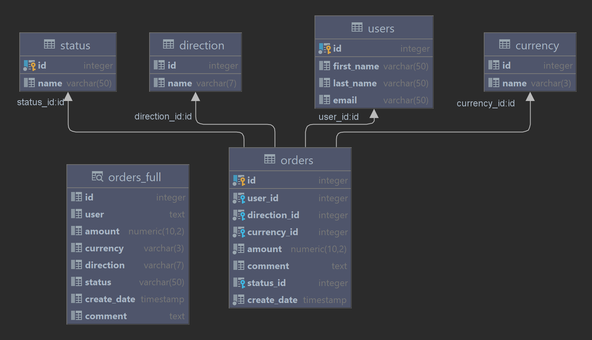

# HW6
Домашнее задания HW6.

Содержит 1 задание.

Темы : SQL, таблицы, view.

## Структура исходного кода
Каталог с решением имеет следующую структуру :
- dvdrental - папка содержит тестовую базу для самообразования и разбора материала прочитанного на лекции;
    - bin - папка с бинарниками необходимыми выгрузки файла дампа и для его восстановления;
    - create_db.bat - скрипт для пересоздания БД с нуля;
    - dvdrental-dump.sql - дамп тестовой БД;
- docker_install_PgSQL.bat - скрипт установки PostgreSQL 12 в Docker;
- dump_HW6_db.bat - скрипт для выгрузки готовой БД домашнего задания;
- hw6-dump.sql - итоговый файл дампа Вашей БД, необходим для похождения тестов
- hw6.tests - тестовый проект для задания; запрещен к модификации.

## Задание 1. База данных “Счета”
Разработать базу данных “Счета”.

### Введение
База данных “Счета” содержит минимум таблиц для работы с выставленными счетами.Соответствует 3й нормальной форме.

### Задание
Необходимо разработать базу данныхв соответствии со схемой, приложенной ниже.

Требования :
- Все поля `id` должны быть первичными ключами с автогенерацией;
- Все таблицы-словари (те которые содержать только 2 поля - `id, name`) должны иметь уникальность по полю `name`;
- Таблица `users` должна иметь уникальность по всем полям - `first_name, last_name, email`;
- Таблица `orders` не должна иметь никаких ограничений по уникальности;
- View `orders_full` должна быть в виде развернутой структуры таблицы `orders`;
    - поле user это конкатанация `first_name, last_name` через пробел;
    - остальные поля это либонапрямую из таблицы `orders`, либо это значения полей name из словарей;

**Для выполнения задания, вы можете использовать любую IDE и результатом будет файл hw6-dump.sql положенный в корень репозитория. Для создания файла hw6-dump.sql используйте dump_HW6_db.bat**

### Советы
- Обратите внимание на типы полей описанных в изображении;
- Для конкатанации полей используйте `concat(<field1>, ' ', <field2>) as "<alias>"`;
- Для корректного отображения имен полей во вьюхе используйте алиасы

### Чек-лист
- Таблицы реализованы.
- View реализована и содержит развернутую структуру без `id`, кроме `orders.id`.